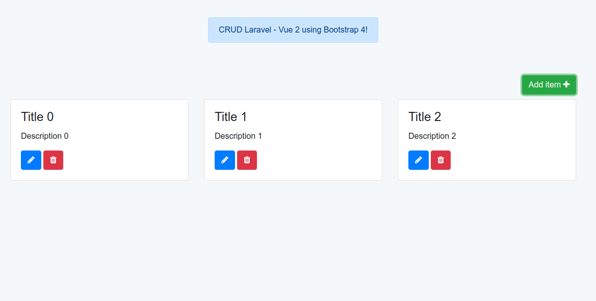

## CRUD Laravel 5.5 - Vue 2.5 Using Bootstrap 4

Simple tutorial to create a CRUD using Laravel 5.5 and Vue 2.5. In this tutorial we will use Axios, Font awesome, JQuery and Bootstrap 4. 

I mention that I have been guided by the Chizzoz tutorial:

- [Laravel-vue-foundation-simple-CRUD](https://github.com/Chizzoz/laravel-vue-foundation-simple-CRUD).

In this tutorial I use the latest version of the Laravel framework, as well as the latest version of vue js. also implementing the new bootstrap 4 framework, using cards, flex, buttons and modal.



The development environment that I am using is [valet](https://laravel.com/docs/5.5/valet)

1.- Create laravel project.

```cmd
	composer create-project laravel/laravel laravel-vue --prefer-dist
```

2.- Configure environment file .env
	Modify access to the database.
```php
	DB_CONNECTION=mysql
	DB_HOST=127.0.0.1
	DB_PORT=3306
	DB_DATABASE=laravel_vue
	DB_USERNAME=*****
	DB_PASSWORD=*****
```
3.- Create migration of the table item

```php
php artisan make:migration create_table_item --create=item
```

4.- Add to create_users_table migration.

```php
Schema::defaultStringLength(191);
```
before
```php
Schema::create('users', function (Blueprint $table)
```

5.- Execute the following command.

```cmd
php artisan migrate
```

## Configuration of the package.json file

We will uninstall bootstrap 3

```cmd
npm uninstall bootstrap-sass -D
```

Install the following packages

```cmd
npm install bootstrap@4.0.0-beta.2 -D
npm install popper.js -D
npm install font-awesome -D
```

Edit file resources\assets\sass\app.scss

```
@import url("https://fonts.googleapis.com/css?family=Raleway:300,400,600");

@import "variables.scss";

$fa-font-path: "../../../node_modules/font-awesome/fonts" !default;

@import 'node_modules/font-awesome/scss/font-awesome.scss';

@import "node_modules/bootstrap/scss/bootstrap.scss";

```

Edit file resources\assets\sass\\\_variables.scss

```css
// Body
$body-bg: #f5f8fa;

// Brands
$blue:    #007bff !default;
$indigo:  #6610f2 !default;
$purple:  #6f42c1 !default;
$pink:    #bf2f8a !default;
$red:     #dc3545 !default;
$orange:  #fd7e14 !default;
$yellow:  #ffc107 !default;
$green:   #28a745 !default;
$teal:    #20c997 !default;
$cyan:    #17a2b8 !default;
$agua:    #43ebff !default;


$colors: (
  blue: $blue,
  indigo: $indigo,
  purple: $purple,
  pink: $pink,
  red: $red,
  orange: $orange,
  yellow: $yellow,
  green: $green,
  teal: $teal,
  cyan: $cyan,
  agua: $agua
) !default;

$theme-colors: (
  primary: $blue,
  success: $green,
  info: $cyan,
  warning: $yellow,
  danger: $red,
  pink: $pink,
  agua: $agua
) !default;
```
Edit file resources\assets\js\bootstrap.js
```js
try {
    window.$ = window.jQuery = require('jquery');
    window.Popper = require('popper.js').default;
    require('bootstrap');
} catch (e) {}
```
Execute the following command.
```cmd
npm install

```

## Configuration of the webpack.mix.js file.

```js
let mix = require('laravel-mix');
mix.autoload({
        jquery: ['$', 'window.jQuery'],
        'popper.js/dist/umd/popper.js': ['Popper']
    });

mix.js('resources/assets/js/app.js', 'public/js')
   .sass('resources/assets/sass/app.scss', 'public/css');
```
## CRUD development process.

6.- Create model item

```cmd
php artisan make:model Item.
```

Add the following code lines.
```php
protected $table = "item";
    protected $fillable = [
        'title',
        'description'
    ];
```

7.- Create controller ItemController.

```cmd
php artisan make:controller ItemController
```
Add the following code lines.
```php

	public function index(Request $request)
	{
		if (!$request->ajax()) abort( 404 );

		return [ 'items' => Item::all() ];
	}
	
	public function items()
	{
		return view('items.index');
	}

	public function store(Request $request)
	{
		$create = Item::create($request->all());
		return response()->json($create);
	}

	public function update(Request $request, $item)
	{
		$edit = Item::find($item)->update($request->all());
		return response()->json($edit);
	}

	public function destroy($item)
    {
        Item::find($item)->delete();
        return response()->json(['ok']);
    }

```

8.- Create component Item.vue in path resources\assets\js\components

```js
<template>
    <div class="container">
        <div class="row pt-5">
            <div class="col-lg-12 d-flex justify-content-center">
                <div class="alert alert-primary" role="alert">
                    CRUD Laravel - Vue 2 using Bootstrap 4!
                </div>
            </div>
        </div>
        <div class="row pt-5">

            <div class="col-lg-12 d-flex justify-content-end pb-2">
                <button type="button" class="btn btn-success" data-toggle="modal" data-target="#create-item">
                    Add item <i class="fa fa-plus" aria-hidden="true"></i>
                </button>
            </div>

            <div class="col-lg-12 d-flex justify-content-center">
                <div v-if="!items.length" class="alert alert-danger" role="alert">
                    Not items <i class="fa fa-frown-o" aria-hidden="true"></i>
                </div>
            </div>

            <div v-for="item in items" class="col-lg-4">
                <div class="card mb-3">
                    <div class="card-body">
                        <h4 class="card-title">{{ item.title }}</h4>
                        <p class="card-text">{{ item.description }}</p>
                        <button type="button" class="btn btn-primary" @click.prevent="editItem( item )" ><i class="fa fa-pencil" aria-hidden="true"></i></button>
                        <button type="button" class="btn btn-danger" @click.prevent="deleteItem( item )"><i class="fa fa-trash" aria-hidden="true"></i></button>
                    </div>
                </div>
            </div>

            <!-- Create Item Modal -->
            <div class="modal fade" id="create-item" tabindex="-1" role="dialog" aria-labelledby="exampleModalLabel" aria-hidden="true">
                <div class="modal-dialog" role="document">
                    <div class="modal-content">
                        <div class="modal-header">
                            <h5 class="modal-title" id="exampleModalLabel">Create item</h5>
                            <button type="button" class="close" data-dismiss="modal" aria-label="Close">
                                <span aria-hidden="true">&times;</span>
                            </button>
                        </div>
                        <form method="post" enctype="multipart/form-data" @submit.prevent="createItem">
                            <div class="modal-body">
                                    <div class="col-lg-12">
                                        <div class="form-group">
                                            <label for="title">Title</label>
                                            <input type="text" class="form-control" id="title" placeholder="Enter title" v-model="newItem.title">
                                        </div>
                                    </div>
                                    <div class="col-lg-12">
                                        <div class="form-group">
                                            <label for="description">Description</label>
                                            <textarea class="form-control" id="description" rows="3" placeholder="Enter description" v-model="newItem.description"></textarea>
                                        </div>
                                    </div>
                            </div>
                            <div class="modal-footer">
                                <button type="button" class="btn btn-secondary" data-dismiss="modal">Close</button>
                                <button type="submit" class="btn btn-primary">Save</button>
                            </div>
                        </form>
                    </div>
                </div>
            </div>

            <!-- Eit item Modal -->
            <div class="modal fade" id="edit-item" tabindex="-1" role="dialog" aria-labelledby="exampleModalLabel" aria-hidden="true">
                <div class="modal-dialog" role="document">
                    <div class="modal-content">
                        <div class="modal-header">
                            <h5 class="modal-title" id="exampleModalLabel">Edit item</h5>
                            <button type="button" class="close" data-dismiss="modal" aria-label="Close">
                                <span aria-hidden="true">&times;</span>
                            </button>
                        </div>
                        <form method="post" enctype="multipart/form-data" @submit.prevent="updateItem( fillItem.id )">
                            <input type="hidden" name="_method" value="PUT">
                            <div class="modal-body">
                                    <div class="col-lg-12">
                                        <div class="form-group">
                                            <label for="title">Title</label>
                                            <input type="text" class="form-control" id="title" placeholder="Enter title" v-model="fillItem.title">
                                        </div>
                                    </div>
                                    <div class="col-lg-12">
                                        <div class="form-group">
                                            <label for="description">Description</label>
                                            <textarea class="form-control" id="description" rows="3" placeholder="Enter description" v-model="fillItem.description"></textarea>
                                        </div>
                                    </div>
                            </div>
                            <div class="modal-footer">
                                <button type="button" class="btn btn-secondary" data-dismiss="modal">Close</button>
                                <button type="submit" class="btn btn-primary">Save</button>
                            </div>
                        </form>
                    </div>
                </div>
            </div>

        </div>
    </div>
</template>


<script>
    export default {
        mounted() {
            this.getItems();
        },
        data: () => ({
            items: [],
            newItem: { 'title': '', 'description': ''},
            fillItem: { 'title': '', 'description': '', 'id': ''}
        }),
        methods: {
            getItems() {
                axios.get( 'vue-items' ).then( response => {
                    let answer = response.data;
                    this.items = answer.items;
                })
            },
            createItem() {
                let input = this.newItem;

                axios.post('vue-items', input).then( (response) => {

                    this.items.push(response.data);
                    this.newItem = {'title': '', 'description': ''};
                    $('#create-item').modal('hide');

                }).catch( (error) => {
                    console.log( error.response.data )
                })
            },
            editItem( item ) {
                let edit = this.fillItem;

                edit.title = item.title;
                edit.description = item.description;
                edit.id = item.id;

                $("#edit-item").modal('show');
            },
            updateItem( id ){
                let input = this.fillItem;

                axios.put('vue-items/' + id, input).then( (response)=> {

                    this.getItems();
                    this.fillItem = {'title': '', 'description': '', 'id': ''};
                    $('#edit-item').modal('hide');

                }).catch( (error)=> {
                    console.log( error.response.data )
                })
            },
            deleteItem( item ) {
                axios.delete('vue-items/' + item.id).then( (response) => {
                    this.getItems();
                });
            }
        }
    }
</script>

```

9.- Edit file app.js in path resources\assets\js

```js
require('./bootstrap');

window.Vue = require('vue');

Vue.component('item', require('./components/Item.vue'));

const app = new Vue({
    el: '#app'
});

```

10.- Create Layout in resources\views\layouts --> app.blade.php

```php

<!DOCTYPE html>
<html lang="{{ app()->getLocale() }}">
<head>
    <meta charset="utf-8">
    <meta content="zaratedev" name="author" />
    <meta content="desarrollador web y móvil" name="description" />
    <meta content="laravel, vue, crud, bootstrap 4" name="keywords" />
    <meta http-equiv="X-UA-Compatible" content="IE=edge">
    <meta name="viewport" content="width=device-width, initial-scale=1">
    <!-- CSRF Token -->
    <meta name="csrf-token" content="{{ csrf_token() }}">
    <title>{{ config('app.name', 'Laravel') }} - desarrollo web y móvil.</title>
    <!-- Styles -->
    <link href="{{ asset('css/app.css') }}" rel="stylesheet">
    @yield( 'css' )
</head>
<body>
    <div id="app">
        @yield('content')
    </div>
    <!-- Scripts -->
    <script src="{{ asset('js/app.js') }}"></script>
    @yield( 'js' )
</body>
</html>

```

11.- Create view of CRUD in resources\views\items --> index.blade.php

```php
@extends( 'layouts.app' )

@section( 'content' )
	<item></item>
@endsection
```

12.- Edit file routes web.php

```php
Route::get('/', function () {
    return view('welcome');
});

Route::get('items', 'ItemController@items');
Route::resource('vue-items', 'ItemController');
```

13.- Execute the following command <code>npm run dev</code>